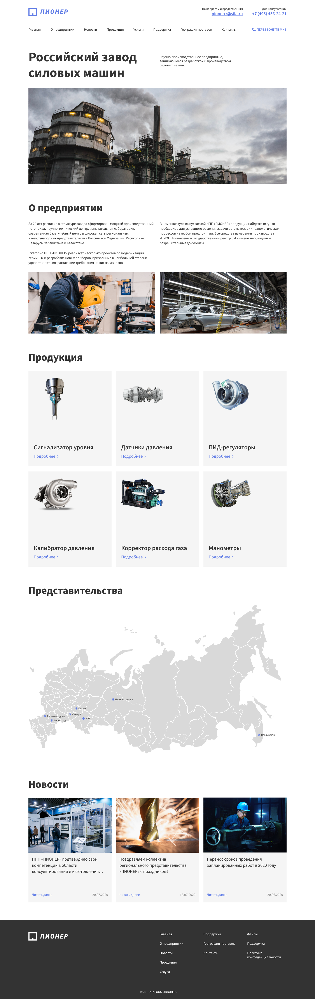

# Проект «Пионер - Российский завод силовых машин»

## Содержание

- [Технологии](#технологии)
- [Описание проекта](#описание-проекта)
- [Скриншот проекта](#скриншот-проекта)
- [Ссылки](#ссылки)
- [Источники](#источники)

## Технологии

## Описание проекта

Проект реализует одностраничный сайт посвещеный Российскому заводу

## Скриншот проекта

## Ссылки

- [Репозиторий проекта](https://github.com/LeaTrixWizzer/pioner.git)
- [Макет проекта](https://www.figma.com/design/rTIAAgDAufAPl61AWjYlrb/%D0%9F%D0%B8%D0%BE%D0%BD%D0%B5%D1%80?node-id=0-271&t=iYagFOu8ohyjNRnc-0)
- [Публикация проекта](https://leatrixwizzer.github.io/pioner/)

## Источники

@verstaem.online
